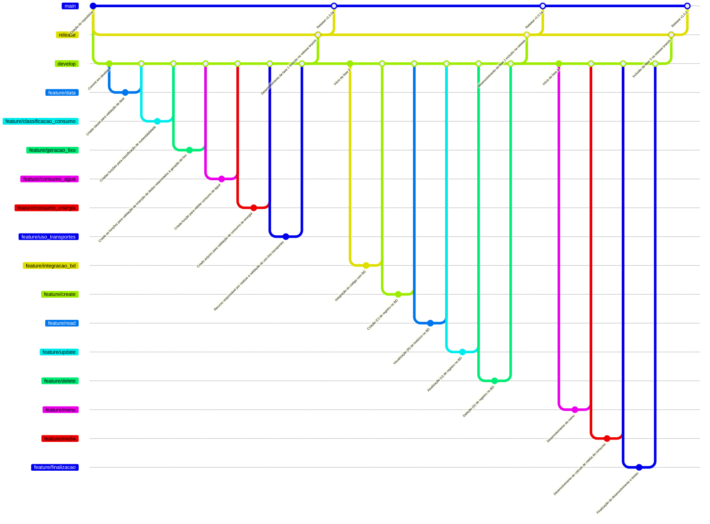

<h1> CRUD Python + MySQL 🐬 </h1>

Projeto integrador do primeiro semestre do curso de Sistemas de Informação da PUCCAMP - 2025

<hr/>

<h2>Sobre o projeto</h2>
O projeto integrador tem como objetivo principal o desenvolvimento de um sistema de monitoramento de sustentabilidade pessoal, utilizando tecnologias como Python, MySQL para armazenar os dados (banco de dados), Git e GitHub para o versionamento do sistema e Trello para o gerenciamento do projeto.

<ul>
  <li>
    Coletar e analisar dados de consumo de água, energia elétrica, geração de resíduos e uso de transporte dos usuários.
  </li>
  <li>
    Desenvolver um algoritmo para calcular e classificar a sustentabilidade pessoal com base nos dados coletados.
  </li>
  <li>
    Implementar um banco de dados para armazenar registros diários de monitoramento de sustentabilidade.
  </li>
  <li>
    Utilizar o terminal para inserção e visualização das informações do sistema.
  </li>
  <li>
    Permitir que os usuários acompanhem suas médias de sustentabilidade ao longo do tempo.

  </li>
</ul>

<hr />

<h4>Modelo do versionamento - Todas as fases do projeto</h4>



<hr/>
<h3>Autores:</h3>

<table>
  <tr>
    <td align="center">
      <a href="https://github.com/EduardoFagundesSilva">
        <br>
        <sub>
          <b>Eduardo Fagundes</b>
        </sub>
      </a><br>
    </td>
     <td align="center">
      <a href="https://github.com/egili">
        <br>
        <sub>
          <b>Eliseu Gili</b>
        </sub>
      </a>
    </td>
     <td align="center">
      <a href="https://github.com/IgorFurtadoo">
        <br>
        <sub>
          <b>Igor Furtado</b>
        </sub>
      </a><br>
    </td>
     <td align="center">
      <a href="https://github.com/LnXHero">
        <br>
        <sub>
          <b>Guilherme Heron</b>
        </sub>
      </a><br>
    </td>
    <td align="center">
      <a href="https://github.com/lucasathanasio">
        <br>
        <sub>
          <b>Lucas Athanasio</b>
        </sub>
      </a><br>
    </td>
   </table>

<br>
<hr>
<br>

## 🚀 Como rodar a aplicação localmente?

### 📄 1. Configurar variáveis de ambiente

Crie um arquivo `.env` dentro do diretório `source/`, contendo as seguintes variáveis:

```bash
DB_HOST=ip_banco_de_dados\
DB_PORT=porta_banco_de_dados\
DB_USER=usuario_banco_de_dados\
DB_PASSWORD=senha_banco_de_dados 
DB_DATABASE=database_que_sera_utilizada
```


### 🐍 2. Criar e ativar o ambiente virtual

```bash
python -m venv .venv
```

Ative o ambiente virtual:

- Linux/macOS:

```bash
source .venv/bin/activate
```

- Windows:

```
.venv\Scripts\activate
``` 

### 📦 3. Instalar dependências

```bash
pip install -r requirements.txt
``` 

### ▶️ 4. Executar a aplicação

```bash
python source/main.py
``` 
